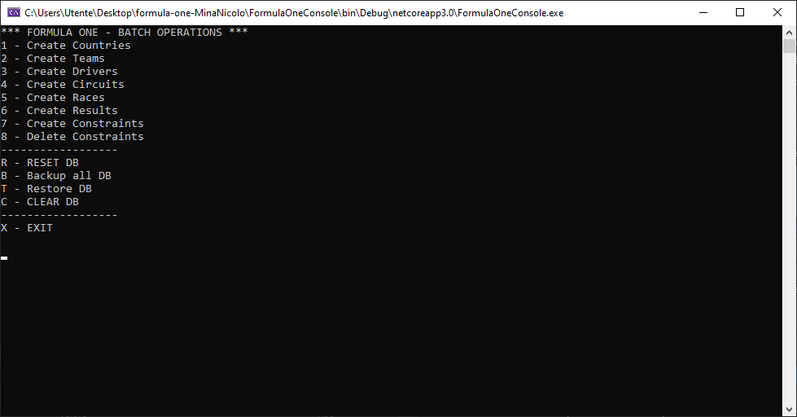

# FORMULA ONE PROJECT
## MINA NICOLÒ - 5^B Informatica A.S. 2020/2021
### I.I.S. "G. Vallauri" - Fossano (CN)

- CLI: you can do basic operations on Database like create a table, delete database, backup database, set and delete constraints.
- WebForm: simple web interface where are showed tables with their data.
- DLL: simple utils with all tools necessary to interact with database.


##CLI EXAMPLE CODE

```javascript
public static bool callExecuteSqlScript(string scriptName)
{
    try
    {
        dbt.ExecuteSqlScript(scriptName + ".sql");
        Console.WriteLine("\nCreate " + scriptName + " - SUCCESS\n");
        return true;
    }
    catch (Exception ex)
    {
        Console.WriteLine("\nCreate " + scriptName + " - ERROR: " + ex.Message + "\n");
        return false;
    }
}
```
#CLI INTERFACE



###DLL EXAMPLE CODE
```javascript
public void DropTable(string tableName)
{
    SqlConnection con = new SqlConnection(CONNECTION_STRING);
    SqlCommand cmd = new SqlCommand("DROP TABLE IF EXISTS " + tableName + ";", con);
    con.Open();
    try
    {
        cmd.ExecuteNonQuery();
    }
    catch (SqlException err)
    {
        Console.WriteLine("\tErrore SQL: " + err.Number + " - " + err.Message);
    }
    con.Close();
}
```

###ASP.NET EXAMPLE CODE
```javascript
protected void Page_Load(object sender, EventArgs e)
{
    if (!Page.IsPostBack)
    {
        // Inizializzazioni che vengono eseguite solo la prima volta
        lblMessaggio.Text = "Selezionare una voce dalla lista";
        List<string> Tablenames = DbTools.GetTables();
        DropDownList1.DataSource = Tablenames;
        DropDownList1.DataBind();
    }
    else
    {
        //Elaborazioni da eseguire tutte le volte che la pagina viene caricata
    }
}
```
